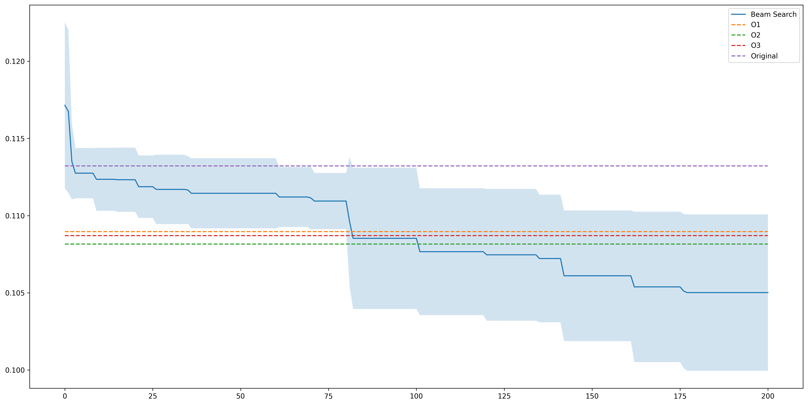

# Structural Autotuning for LLVM IR Code

**A Research Prototype for Exploring Semantic-Agnostic Code Mutations**

## Overview

Optimizing programs for performance is a complex and time-consuming task. Traditional compilers rely on predefined optimization passes that apply semantic-preserving transformations to find and transform known patterns. While effective, these approaches are limited by their reliance on expert-defined patterns and often require manual fine-tuning.

This project explores a novel direction: **structural autotuning through low-level, sub-pass mutations at the LLVM IR level**. Rather than optimizing the selection and order of predefined compiler passes, we investigate semantic-agnostic mutations that can discover novel high-performance variants by exploring a vastly larger search space.

### Key Contributions

1. **Framework for Structural Mutations**: A system that generates structurally mutated LLVM IR variants through low-level transformations
2. **Autotuning Integration**: Beam search exploration strategy to navigate the expanded transformation space
3. **Performance Evaluation**: Comparison against traditional compiler optimization techniques demonstrating the potential for discovering optimizations beyond standard compiler passes

## Project Goals

The primary objectives of this work are threefold:

1. **Develop a mutation framework** that enables systematic generation of structurally mutated LLVM IR variants
2. **Integrate autotuning processes** that can identify high-performing variants tailored to specific hardware and workloads
3. **Evaluate effectiveness** by comparing performance outcomes against traditional compiler optimization techniques

## Structural Mutations

The framework implements five types of structural mutations that operate at the LLVM IR level. These mutations are designed as "micromutations" - low-level transformations that can be applied independently or in combination to explore the optimization space:

### 1. ADD_RANDOM_ARITHMETIC
Inserts random arithmetic operations into the IR. This mutation explores whether adding seemingly redundant computations can lead to performance improvements through effects on register allocation, instruction scheduling, or cache behavior.

### 2. MOVE_BLOCKWISE
Moves basic blocks within functions, potentially affecting control flow and instruction ordering. This explores how code layout and block ordering can impact performance.

### 3. ADD_NEW_COND
Adds new conditional branches to the IR. This mutation investigates whether additional control flow can enable better optimization opportunities or affect branch prediction behavior.

### 4. UNSAFE_MEM_2_REG
Converts memory operations (alloca/load/store) to register operations by promoting stack-allocated variables to SSA registers. This mutation is derived from LLVM's standard `mem2reg` pass (PromoteMemToReg), but with safety checks removed. The original `mem2reg` pass only promotes allocas that are provably safe to promote (e.g., no address-taking, no volatile operations). This unsafe variant attempts promotion even when safety cannot be guaranteed, potentially discovering performance improvements in cases where the standard pass would be conservative.

### 5. DELETE_RANDOM_INSTRUCTION
Removes random instructions from the IR. This mutation explores whether eliminating certain computations can improve performance, potentially by reducing register pressure or enabling other optimizations.

Each mutation is parameterized by a decision vector that controls its specific behavior (e.g., which function, basic block, or instruction to target), allowing for systematic exploration of the mutation space.

## Autotuning Strategy

The framework employs a **beam search** algorithm to explore mutation sequences while maintaining correctness:

- **Search Tree Structure**: Each node represents a mutation sequence, with children representing extensions of that sequence. The tree is built incrementally as promising paths are discovered.

- **Scoring Function**: The algorithm uses a composite scoring function that balances correctness and performance. Correct variants receive higher scores (0.8-1.0 range), with faster variants scoring higher. Incorrect variants are penalized (0.0-0.2 range) but still explored to maintain diversity in the search space.

- **Exploration Strategy**: The algorithm probabilistically selects paths through the search tree based on node scores, balancing exploitation of known good paths with exploration of new branches. The search maintains up to 400 mutations per path and operates within a budget of 1000 program executions.

## Correctness Validation

The system employs a two-stage validation process:

1. **Execution Validation**: Ensures the program runs successfully (6-second timeout, multiple repetitions for statistical reliability)

2. **Output Correctness**: Type-specific distance metrics compute the deviation from expected output:
   - **Scalar**: Absolute difference from expected value
   - **Array**: Sum of element-wise absolute differences
   - **Matrix2D**: Sum of element-wise absolute differences across all dimensions

Programs with `result == 0` (exact match) are considered correct. Only mutations that pass both validation stages are added to the search tree.

## Results and Evaluation

The framework has been evaluated on benchmark programs, comparing the performance of autotuned variants against traditional compiler optimizations (O1, O2, O3) and the original unoptimized code.

### Monte Carlo Pi Calculation Benchmark



The benchmark implements a Monte Carlo method for calculating π by generating random points in a unit square and determining the ratio that fall within a unit circle. This benchmark demonstrates significant performance improvements through structural autotuning:

- **Original runtime**: 0.1132s (baseline)
- **Compiler optimizations**: 
  - O1: 0.1090s
  - O2: 0.1082s  
  - O3: 0.1087s
- **Best autotuned variant**: Achieves performance below all compiler optimization levels
- The beam search algorithm progressively improves performance over ~200 iterations, eventually outperforming traditional compiler optimizations
- Multiple correct variants were discovered, with the search process exploring over 300 correct mutation paths

### Key Observations

1. **Progressive Improvement**: The beam search algorithm shows a clear downward trend in execution time as it explores the mutation space, indicating effective search strategy
2. **Outperforming Compiler Optimizations**: Autotuned variants achieve better performance than standard compiler optimization levels (O1-O3)
3. **Correctness Maintenance**: All reported variants maintain program correctness (result = 0), validating the correctness validation system
4. **Search Space Exploration**: The framework successfully navigates a large search space while maintaining correctness constraints

## Building and Usage

### Requirements

- **LLVM** (with development headers and libraries)
- **CMake** (version 3.10 or higher)
- **C++17** compatible compiler
- **Python 3** with packages: `matplotlib`, `numpy`, `pandas`, `pyvis`

### Building

```bash
./scripts/build.sh
```

Or manually:
```bash
mkdir -p build && cd build
cmake -DCMAKE_BUILD_TYPE=Debug ..
cmake --build .
```

### Running Autotuning

```bash
./build/main <config_file> <results_file_prefix>
```

**Example:**
```bash
./build/main benchmarks/pi/config.json eval_results/pi/run_0
```

This generates:
- `<prefix>_results.csv` - Execution statistics for each mutation attempt
- `<prefix>_tree.json` - Complete beam search tree structure

### Configuration File Format

```json
{
    "original": "path/to/original.ll",
    "modified": "path/to/modified.ll",
    "correct_output": "path/to/correct_output.json",
    "output_file": "path/to/output.json",
    "output_type": "scalar"
}
```

**Output Types:** `"scalar"`, `"array"`, or `"matrix2d"`

## Technical Details

### Runtime Measurement

- Uses LLVM's `lli` interpreter for execution
- CPU affinity pinning (`taskset -c 5`) for consistent measurements to isolate CPU core 5
- Multiple repetitions (default: 2) for statistical reliability
- 6-second timeout to prevent hanging executions
